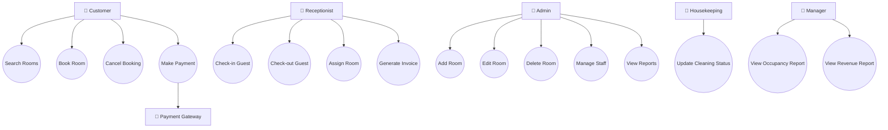
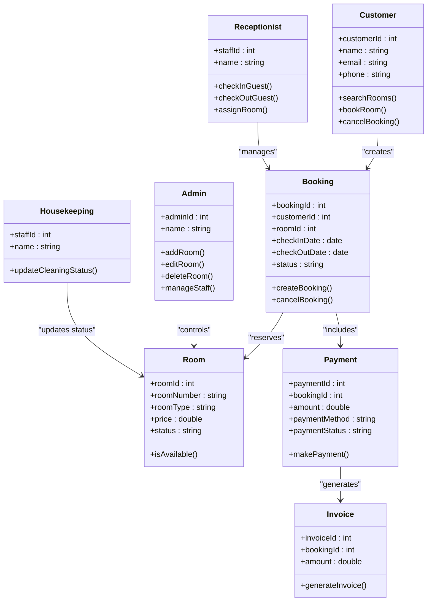
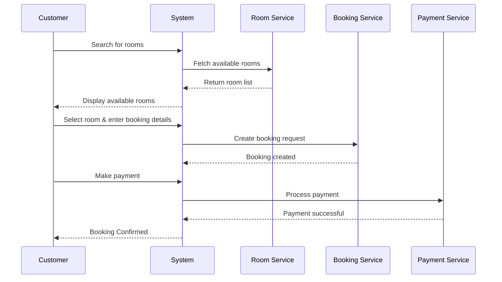
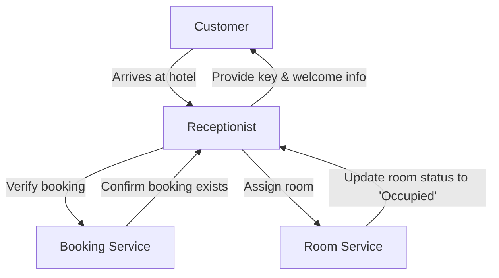
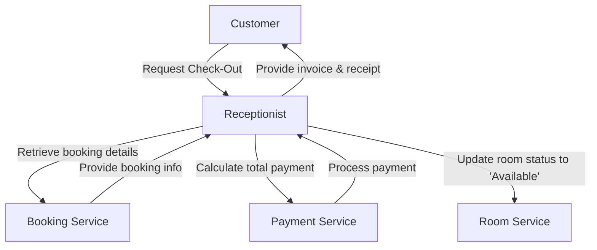
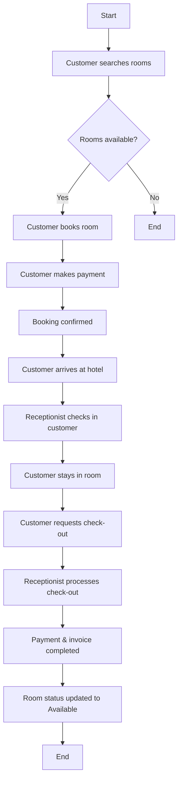
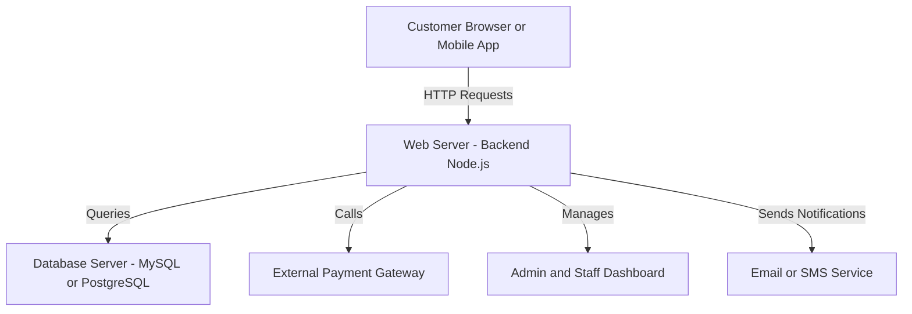
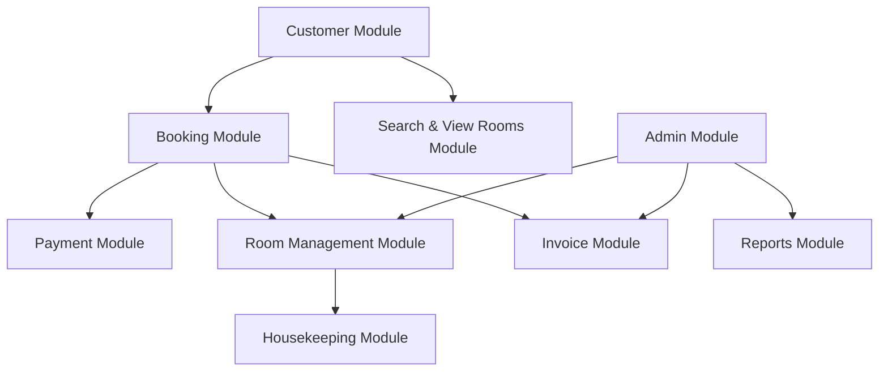

# Hotel Management System – UML Design
**Author:** rajakumari  
**Date:** 2025-12-05  
**Phase:** SDLC – Design Phase
## Table of Contents
1. [Use Case Diagram](#use-case-diagram)
2. [Class Diagram](#class-diagram)
3. [Sequence Diagram – Room Booking](#sequence-diagram--room-booking)
4. [Sequence Diagram – Check-In](#sequence-diagram--check-in-process)
5. [Sequence Diagram – Check-Out](#sequence-diagram--check-out-process)
6. [Activity Diagram](#activity-diagram--hotel-management-workflow)
7. [Deployment Diagram](#deployment-diagram--hotel-management-system)
8. [Component Diagram](#component-diagram--hotel-management-system)

# Use case Diagram

# class diagram

# Sequence Diagram – Room Booking

# Sequence Diagram – Check-In Process

# Sequence Diagram – Check-Out Process

# Activity Diagram – Hotel Management Workflow

# Deployment Diagram – Hotel Management System

# Component Diagram – Hotel Management System

